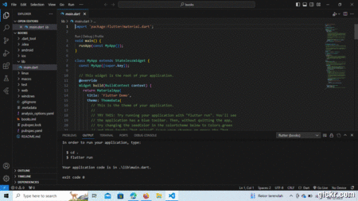
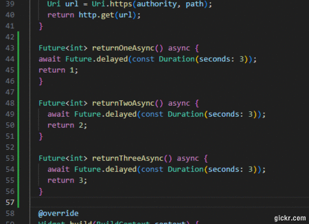
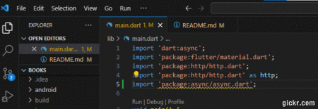
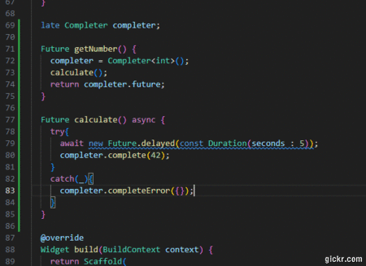
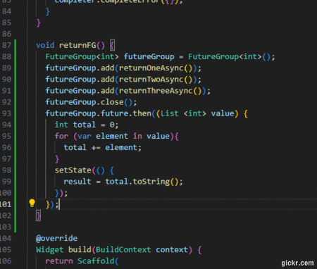
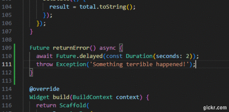
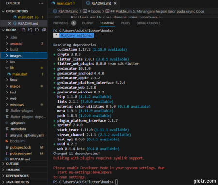
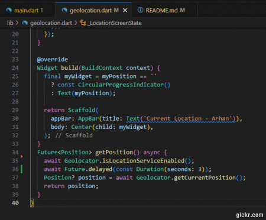

# books

## Praktikum 1: Mengunduh Data dari Web Service (API)

Langkah 1 - 5 dan soal 1 - 2 terdapat pada GIF

<b>Tentang Soal 3</b>
Jelaskan maksud kode langkah 5 tersebut terkait substring dan catchError!
- Substring:
result = value.body.toString().substring(0, 450);
Dalam baris ini, nilai body dari objek yang dikembalikan oleh fungsi getData diubah menjadi string (toString()), dan kemudian diambil sebagian dengan menggunakan metode substring(0, 450). Artinya, hanya sebagian pertama dari string (mulai dari indeks 0 hingga indeks 449) yang disimpan dalam variabel result.
Misalnya, jika value.body adalah string panjangnya 1000 karakter, maka result akan berisi 450 karakter pertama dari string tersebut.

- catchError:
}).catchError((_){
  result = 'An error occurred';
  setState(() {});
});
Bagian ini menggunakan metode catchError untuk menangkap dan menangani kesalahan yang mungkin terjadi saat eksekusi fungsi getData. Jika ada kesalahan, blok kode di dalamnya akan dieksekusi. Dalam hal ini, jika terjadi kesalahan, variabel result diatur menjadi string "An error occurred", dan kemudian setState dipanggil. setState digunakan untuk memberi tahu Flutter bahwa ada perubahan dalam state yang memerlukan pembaruan tampilan.
Parameter _ digunakan sebagai variabel yang mewakili objek kesalahan yang ditangkap.

## Praktikum 2: Menggunakan await/async untuk menghindari callbacks

Langkah 1 - 4 terdapat pada GIF

Soal 4
Jelaskan maksud kode langkah 1 dan 2 tersebut!
- Langkah 1:
Pada langkah ini, menambahkan tiga metode asinkron (returnOneAsync, returnTwoAsync, dan returnThreeAsync) di dalam kelas _FuturePageState. Setiap metode ini menggunakan kata kunci async dan mengembalikan sebuah objek Future<int>. Masing-masing metode ini memiliki tugas yang mirip, yaitu menunda eksekusi selama 3 detik (menggunakan await Future.delayed(const Duration(seconds: 3));) dan kemudian mengembalikan nilai integer yang berbeda (1, 2, atau 3).

Ini memberikan ilustrasi sederhana dari bagaimana fungsi asinkron dapat digunakan untuk menangani operasi yang memerlukan waktu, seperti penundaan (delay) dalam contoh ini.

- Langkah 2:
Pada langkah ini, menambahkan metode count di bawah ketiga metode asinkron sebelumnya. Metode count ini juga menggunakan kata kunci async karena mengandung operasi asinkron di dalamnya.

Dalam metode count, terdapat variabel lokal total yang diinisialisasi dengan nilai 0. Selanjutnya, metode ini menggunakan await untuk memanggil ketiga metode asinkron sebelumnya (returnOneAsync, returnTwoAsync, dan returnThreeAsync) secara berurutan. Setelah masing-masing operasi asinkron selesai, nilai yang dikembalikan dari setiap metode ditambahkan ke variabel total.

Setelah itu, nilai total diubah menjadi string dan disimpan dalam variabel result. Akhirnya, setState dipanggil untuk memberi tahu Flutter bahwa terjadi perubahan dalam state dan tampilan perlu diperbarui.

Dengan cara ini, menggambarkan penggunaan fungsi asinkron dan penggunaan await untuk menangani tugas yang memerlukan waktu dalam lingkungan Flutter.

## Praktikum 3: Menggunakan Completer di Future

Langkah 1 - 4 terdapat pada GIF

Soal 5
Jelaskan maksud kode langkah 2 tersebut!
- Variabel completer:
late Completer completer;
Mendeklarasikan variabel completer dengan tipe Completer. Variabel ini digunakan untuk mengontrol suatu objek Future secara manual. Completer dapat digunakan untuk menyelesaikan atau membatalkan suatu Future secara ekspisit.

- Metode getNumber:
Future getNumber() {
  completer = Completer<int>();
  calculate();
  return completer.future;
}
Metode ini membuat sebuah objek Completer baru dan menyimpannya dalam variabel completer. Selanjutnya, metode calculate dipanggil. Kemudian, metode mengembalikan completer.future. Ini berarti, saat metode ini dipanggil, Future yang akan diselesaikan oleh completer akan dikembalikan, sehingga pemanggil metode dapat menggunakan await untuk menunggu hasil dari completer.future.

- Metode calculate:
Future calculate() async {
  await Future.delayed(const Duration(seconds : 5));
  completer.complete(42);
}
Metode ini adalah contoh penggunaan Completer. Di dalam metode calculate, terdapat penundaan selama 5 detik menggunakan Future.delayed untuk mensimulasikan suatu operasi yang memakan waktu. Setelah penundaan selesai, metode memanggil completer.complete(42), yang berarti Future yang terkait dengan completer sekarang dianggap telah selesai dengan nilai 42.

Langkah 5 - 6 terdapat pada GIF

Soal 6
Jelaskan maksud perbedaan kode langkah 2 dengan langkah 5-6 tersebut!
- perbedaan antara langkah 2 dan langkah 5-6 terletak pada penanganan kesalahan. Pada langkah 2, tidak ada penanganan kesalahan yang diimplementasikan, sementara pada langkah 5-6, metode calculate mencoba menangani kesalahan dengan menggunakan blok try dan catch, dan di langkah 6, hasil dari getNumber() ditangani dengan menggunakan catchError untuk memberikan umpan balik jika terjadi kesalahan. Ini memungkinkan aplikasi untuk merespons lebih baik terhadap kondisi kesalahan selama operasi asinkron.

## Praktikum 4: Memanggil Future secara paralel

Langkah 1 - 3 terdapat pada GIF

Soal 8
Jelaskan maksud perbedaan kode langkah 1 dan 4!
- Perbedaan utama adalah bahwa di langkah 1, menggunakan FutureGroup untuk mengelola future secara eksplisit, sementara di langkah 4, menggunakan Future.wait untuk menunggu sekelompok future tanpa perlu mengelola mereka secara terpisah. Pemakaian Future.wait dapat membuat kode lebih ringkas dan mudah dipahami dalam beberapa kasus.

## Praktikum 5: Menangani Respon Error pada Async Code

Langkah 1 - 3 terdapat pada GIF

Soal 10
Panggil method handleError() tersebut di ElevatedButton, lalu run. Apa hasilnya? Jelaskan perbedaan kode langkah 1 dan 4!
- Hasilnya masih sama dengan yang sebelumnya.
- Perbedaan utamanya adalah Langkah 1 hanya mendefinisikan metode yang melempar pengecualian, sementara langkah 4 menciptakan metode handleError() yang memanggil metode yang mungkin melempar pengecualian dan menangani pengecualian tersebut. Langkah 4 menunjukkan pendekatan penggunaan try, catch, dan finally untuk menangani kesalahan secara eksplisit. Dengan menggunakan try, catch, dan finally, dapat mengontrol alur eksekusi dan melakukan tindakan tertentu saat terjadi kesalahan atau setelah blok try selesai dieksekusi.

## Praktikum 6: Menggunakan Future dengan StatefulWidget

Langkah 1 - 8 terdapat pada GIF

Soal 12
1. Jika Anda tidak melihat animasi loading tampil, kemungkinan itu berjalan sangat cepat. Tambahkan delay pada method getPosition() dengan kode await Future.delayed(const Duration(seconds: 3));
- Terdapat animasi loading yang tampil tanpa menambahkan delay pada method getPosition() tersebut.

2. Apakah Anda mendapatkan koordinat GPS ketika run di browser? Mengapa demikian?
- Iya, saya mendapatkan koordinat GPS ketika di-run. Karena: 
  - Permission Handling:
await Geolocator.requestPermission();
Menggunakan Geolocator.requestPermission() untuk meminta izin lokasi. Tanpa izin yang benar, aplikasi mungkin tidak dapat mengakses data lokasi perangkat.
  - Location Service Check:
await Geolocator.isLocationServiceEnabled();
Menggunakan Geolocator.isLocationServiceEnabled() untuk memastikan bahwa layanan lokasi diaktifkan pada perangkat. Jika layanan ini dimatikan, maka permintaan lokasi tidak akan berhasil.
  - Mendapatkan Lokasi:
Position? position = await Geolocator.getCurrentPosition();
Menggunakan Geolocator.getCurrentPosition() untuk mendapatkan posisi saat ini. Metode ini mengembalikan objek Position yang berisi informasi tentang lokasi geografis, seperti latitude dan longitude.
  - Update State:
setState(() {
  myPosition = myPosition;
});
Setelah mendapatkan posisi, memperbarui state dengan menggunakan setState(). Ini memicu pembaruan tampilan, sehingga widget Text dapat menampilkan koordinat GPS yang baru diperoleh.

Kombinasi dari langkah-langkah ini memastikan bahwa kode berfungsi dengan benar dan dapat menampilkan koordinat GPS saat dijalankan. Kode ini mengikuti prinsip-prinsip Flutter yang baik, yaitu penggunaan Future untuk operasi asinkron (seperti mendapatkan lokasi), pembaruan state menggunakan setState untuk memicu pembaruan tampilan, dan penanganan izin dan layanan lokasi dengan benar menggunakan Geolocator.

## Praktikum 7: Manajemen Future dengan FutureBuilder

Langkah 1 - 4 terdapat pada GIF

Soal 13
Apakah ada perbedaan UI dengan praktikum sebelumnya? Mengapa demikian?
- Tidak ada perbedaan sama sekali dengan praktikum sebelumnya, karena beberapa kemungkinan :
  - Data yang Sama:
Jika data yang ditampilkan (koordinat GPS) sama antara kedua implementasi, maka UI akan tampak serupa.
  - Cara Pembaruan UI:
Meskipun keduanya mencapai tujuan yang sama, yakni menampilkan koordinat GPS, metode yang berbeda (menggunakan FutureBuilder dan setState) dapat memberikan struktur dan pembacaan kode yang berbeda. Namun, dari sudut pandang tampilan pengguna, ini mungkin tidak menghasilkan perbedaan yang mencolok. FutureBuilder adalah widget yang sangat berguna untuk menangani operasi asinkron seperti mendapatkan data dari Future. Dengan menggunakan FutureBuilder, dapat dengan mudah mengelola berbagai status koneksi seperti waiting, done, dan lainnya, dan memperbarui UI sesuai dengan status tersebut.
Perbedaan utama yang dapat terlihat dari UI ini terletak pada cara pengelolaan status koneksi dan cara tampilan data yang terkait diintegrasikan ke dalam widget. FutureBuilder memungkinkan menyusun kode dengan cara yang lebih ekspresif dan membantu memisahkan logika UI dari logika bisnis (dalam hal ini, logika asinkron untuk mendapatkan posisi).

Seperti yang Anda lihat, menggunakan FutureBuilder lebih efisien, clean, dan reactive dengan Future bersama UI.
